Shapefile and Grid Geometries
================
SL
July 1, 2019

## Load Military Installations, Ranges, and Training Areas (MIRTA) Dataset

Accessed from:
<https://catalog.data.gov/dataset/military-installations-ranges-and-training-areas>.
Metadata updated date: January 18, 2017.

Join Fort Benning Georgia and Alabama shapefiles.

Fort Lewis (JBLM) geometry includes remote sites.

``` r
bases <- here::here("data/installations_ranges", "MIRTA_Boundaries.shp") %>%
  sf::st_read() %>% 
  janitor::clean_names()
```

    ## Reading layer `MIRTA_Boundaries' from data source `C:\Users\slewa\Projects\heat_stress\data\installations_ranges\MIRTA_Boundaries.shp' using driver `ESRI Shapefile'
    ## Simple feature collection with 750 features and 6 fields
    ## geometry type:  MULTIPOLYGON
    ## dimension:      XY
    ## bbox:           xmin: -168.8576 ymin: 13.30706 xmax: 174.1565 ymax: 64.87792
    ## epsg (SRID):    4326
    ## proj4string:    +proj=longlat +datum=WGS84 +no_defs

``` r
## Edit Fort Benning geometries
benning_join <-
  bases %>%
    filter(stringr::str_detect(site_name, "Fort Benning")) %>% 
    dplyr::select(geometry) %>% st_union() 

bases <- bases %>% 
  filter(site_name != "Fort Benning") %>%
  mutate(geometry = replace(geometry, site_name == "Fort Benning GA", benning_join ))

rm(benning_join)

## Edit Fort Lewis (JBLM) geometries to remove remote polygons
## Include sites near Yakima, WA and Camp Rilea, OR

# "Before" plot
bases %>% 
    filter(site_name == "Fort Lewis") %>% 
    ggplot() +
       geom_sf() 
```

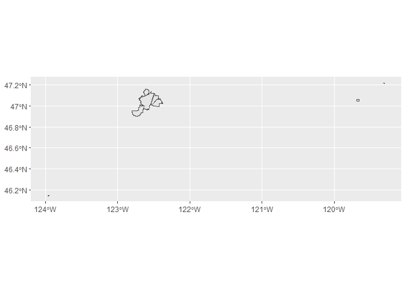<!-- -->

``` r
# Set bounding box
jblm_filt_bbox <- 
  sf::st_bbox(c(xmin = -123, 
                ymin = 46.8, 
                xmax = -122, 
                ymax = 47.2), 
                crs = st_crs(4326)) %>% 
 sf::st_as_sfc(.)


# separate MULTIPOLYGON to POLYGON(s)

jblm_polygon <-
   bases %>% 
    filter(site_name == "Fort Lewis") %>% 
    sf::st_cast(., "POLYGON")
```

    ## Warning in st_cast.sf(., "POLYGON"): repeating attributes for all sub-geometries
    ## for which they may not be constant

``` r
# identify polygons within bbox
jblm_new_geom <-
  sf::st_within(jblm_polygon$geometry, jblm_filt_bbox) 
```

    ## although coordinates are longitude/latitude, st_within assumes that they are planar

``` r
# add column for within box status
jblm_polygon <-
  jblm_polygon %>% 
    mutate(within_bbox = lapply(jblm_new_geom, `[`, 1)) %>% 
    filter(within_bbox == 1) %>% 
    dplyr::select(-within_bbox) %>%
    sf::st_union()


# replace Fort Lewis geometry in main dataframe

bases <- bases %>% 
  mutate(geometry = replace(geometry, site_name == "Fort Lewis", jblm_polygon))

rm(jblm_filt_bbox, jblm_new_geom, jblm_polygon)

# "After" plot
bases %>% 
    filter(site_name == "Fort Lewis") %>% 
    ggplot() +
       geom_sf() 
```

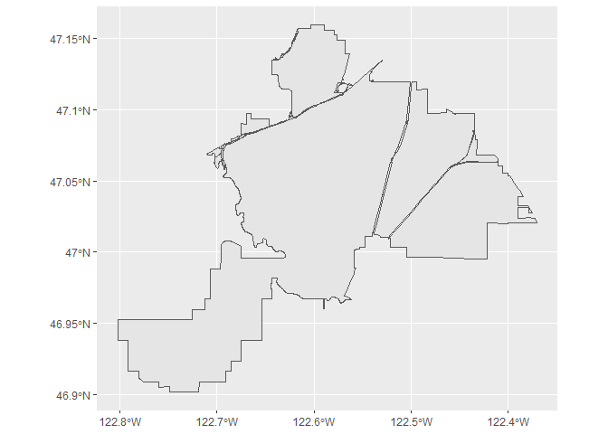<!-- -->

## Select installations

Select bases for analyses. Citeria: in list of top CONUS bases for heat
illnesses from MSMR report (April 2018). Additional Army installations
based on HSI counts and rates (from DMED) and for diversity of climate
regions.

Add centroid column.

``` r
# Look-up base name in MITRA list  
#  search_names <- bases$site_name %>% as.character()

#  stringr::str_subset(search_names, "Lewis")

select_bases <-
  bases %>%
    dplyr::filter(.$site_name %in% c("Fort Benning GA", "Fort Bragg","Fort Campbell",
                              "Fort Jackson", "Fort Polk", "Fort Hood",
                              "Fort Stewart", "Fort Leonard Wood", "Fort Riley",
                              "NTC and Fort Irwin", "Fort Bliss", "Fort Lewis",
                              "Fort Sill", "Fort Carson", "Fort Gordon",
                              "Fort Drum", "MCB Camp Lejeune", "MCRD Beaufort Parris Island",
                              "MCB Camp Pendleton", "MCRD San Diego", "MCB Quantico",
                              "Twentynine Palms Main Base", "Lackland AFB", "Eglin AFB", "Fort Sam Houston")) %>% 
    mutate(centroid = st_centroid(geometry)) %>% 
    dplyr::select(-c("joint_base", "country", "oper_stat"))

select_bases
```

    ## Simple feature collection with 25 features and 3 fields
    ## Active geometry column: geometry
    ## geometry type:  GEOMETRY
    ## dimension:      XY
    ## bbox:           xmin: -122.8021 ymin: 29.36673 xmax: -75.38405 ymax: 47.15951
    ## epsg (SRID):    4326
    ## proj4string:    +proj=longlat +datum=WGS84 +no_defs
    ## First 10 features:
    ##      component                  site_name state_terr
    ## 1  Army Active            Fort Benning GA    Georgia
    ## 2  Army Active              Fort Campbell   Kentucky
    ## 3    MC Active               MCB Quantico   Virginia
    ## 4    MC Active             MCRD San Diego California
    ## 5  Army Active                 Fort Riley     Kansas
    ## 6  Army Active         NTC and Fort Irwin California
    ## 7  Army Active                Fort Gordon    Georgia
    ## 8    MC Active Twentynine Palms Main Base California
    ## 9  Army Active                  Fort Sill   Oklahoma
    ## 10 Army Active                Fort Carson   Colorado
    ##                          geometry                   centroid
    ## 1  POLYGON ((-84.8882 32.25929...  POINT (-84.81164 32.3917)
    ## 2  MULTIPOLYGON (((-87.65135 3...  POINT (-87.62461 36.6222)
    ## 3  MULTIPOLYGON (((-77.4884 38...  POINT (-77.4572 38.55207)
    ## 4  MULTIPOLYGON (((-117.2036 3... POINT (-117.1977 32.74017)
    ## 5  MULTIPOLYGON (((-96.93518 3... POINT (-96.82482 39.20675)
    ## 6  MULTIPOLYGON (((-116.389 35... POINT (-116.6333 35.37432)
    ## 7  MULTIPOLYGON (((-82.11816 3... POINT (-82.23727 33.35667)
    ## 8  MULTIPOLYGON (((-116.3095 3... POINT (-116.1387 34.45805)
    ## 9  MULTIPOLYGON (((-98.64978 3... POINT (-98.52759 34.69519)
    ## 10 MULTIPOLYGON (((-104.7321 3...  POINT (-104.853 38.47304)

``` r
## Plot selected installations
purrr::map(select_bases$site_name,
           function(x) {
             ggplot() +
               geom_sf(data = filter(select_bases, site_name == x)) +
               geom_sf(data = st_centroid(filter(select_bases, site_name == x))) +
                ggtitle(x) +
                theme_bw() +
                theme(axis.text.x = element_text(size = rel(1)),
                      axis.text.y = element_text(size = rel(1))) 
           })

#cowplot::plot_grid(plotlist = bases_plot)
```

## Load NLDAS grids

NLDAS grid shapefile from:
<https://ldas.gsfc.nasa.gov/sites/default/files/ldas/nldas/NLDAS_Grid_Reference.zip>

``` r
nldas_grid <- 
  here::here("data/nldas_grids", "NLDAS_Grid_Reference.shp") %>%
  sf::st_read() %>% 
  janitor::clean_names()
```

    ## Reading layer `NLDAS_Grid_Reference' from data source `C:\Users\slewa\Projects\heat_stress\data\nldas_grids\NLDAS_Grid_Reference.shp' using driver `ESRI Shapefile'
    ## Simple feature collection with 103936 features and 5 fields
    ## geometry type:  POLYGON
    ## dimension:      XY
    ## bbox:           xmin: -125 ymin: 25 xmax: -67 ymax: 53
    ## epsg (SRID):    4326
    ## proj4string:    +proj=longlat +datum=WGS84 +no_defs

``` r
nldas_grid
```

    ## Simple feature collection with 103936 features and 5 fields
    ## geometry type:  POLYGON
    ## dimension:      XY
    ## bbox:           xmin: -125 ymin: 25 xmax: -67 ymax: 53
    ## epsg (SRID):    4326
    ## proj4string:    +proj=longlat +datum=WGS84 +no_defs
    ## First 10 features:
    ##      centerx centery nldas_x nldas_y nldas_id                       geometry
    ## 1  -124.9375 25.0625       1       1     x1y1 POLYGON ((-124.875 25, -125...
    ## 2  -124.8125 25.0625       2       1     x2y1 POLYGON ((-124.75 25, -124....
    ## 3  -124.6875 25.0625       3       1     x3y1 POLYGON ((-124.625 25, -124...
    ## 4  -124.5625 25.0625       4       1     x4y1 POLYGON ((-124.5 25, -124.6...
    ## 5  -124.4375 25.0625       5       1     x5y1 POLYGON ((-124.375 25, -124...
    ## 6  -124.3125 25.0625       6       1     x6y1 POLYGON ((-124.25 25, -124....
    ## 7  -124.1875 25.0625       7       1     x7y1 POLYGON ((-124.125 25, -124...
    ## 8  -124.0625 25.0625       8       1     x8y1 POLYGON ((-124 25, -124.125...
    ## 9  -123.9375 25.0625       9       1     x9y1 POLYGON ((-123.875 25, -124...
    ## 10 -123.8125 25.0625      10       1    x10y1 POLYGON ((-123.75 25, -123....

## NLDAS and Installation Grid Overlap

``` r
# Identify all NLDAS grids intersected by installation shapefiles

bases_nldas = NULL

  for (i in 1:nrow(select_bases)) {
    i_base = select_bases[i,] 
    base_nldas = st_intersection(i_base, nldas_grid) 
    bases_nldas = rbind(bases_nldas, base_nldas)
  }

bases_nldas
```

    ## Simple feature collection with 300 features and 8 fields
    ## Active geometry column: centroid
    ## geometry type:  POINT
    ## dimension:      XY
    ## bbox:           xmin: -122.8021 ymin: 29.36673 xmax: -75.38405 ymax: 47.15951
    ## epsg (SRID):    4326
    ## proj4string:    +proj=longlat +datum=WGS84 +no_defs
    ## First 10 features:
    ##       component       site_name state_terr  centerx centery nldas_x nldas_y
    ## 1   Army Active Fort Benning GA    Georgia -84.9375 32.1875     321      58
    ## 1.1 Army Active Fort Benning GA    Georgia -84.8125 32.1875     322      58
    ## 1.2 Army Active Fort Benning GA    Georgia -85.0625 32.3125     320      59
    ## 1.3 Army Active Fort Benning GA    Georgia -84.9375 32.3125     321      59
    ## 1.4 Army Active Fort Benning GA    Georgia -84.8125 32.3125     322      59
    ## 1.5 Army Active Fort Benning GA    Georgia -84.6875 32.3125     323      59
    ## 1.6 Army Active Fort Benning GA    Georgia -84.9375 32.4375     321      60
    ## 1.7 Army Active Fort Benning GA    Georgia -84.8125 32.4375     322      60
    ## 1.8 Army Active Fort Benning GA    Georgia -84.6875 32.4375     323      60
    ## 1.9 Army Active Fort Benning GA    Georgia -84.8125 32.5625     322      61
    ##     nldas_id                       geometry                  centroid
    ## 1    x321y58 MULTIPOLYGON (((-84.90602 3... POINT (-84.81164 32.3917)
    ## 1.1  x322y58 POLYGON ((-84.81997 32.25, ... POINT (-84.81164 32.3917)
    ## 1.2  x320y59 POLYGON ((-85 32.29875, -85... POINT (-84.81164 32.3917)
    ## 1.3  x321y59 POLYGON ((-84.8882 32.25929... POINT (-84.81164 32.3917)
    ## 1.4  x322y59 POLYGON ((-84.75 32.33047, ... POINT (-84.81164 32.3917)
    ## 1.5  x323y59 POLYGON ((-84.65872 32.375,... POINT (-84.81164 32.3917)
    ## 1.6  x321y60 MULTIPOLYGON (((-84.97334 3... POINT (-84.81164 32.3917)
    ## 1.7  x322y60 POLYGON ((-84.875 32.45522,... POINT (-84.81164 32.3917)
    ## 1.8  x323y60 POLYGON ((-84.63749 32.5, -... POINT (-84.81164 32.3917)
    ## 1.9  x322y61 POLYGON ((-84.84992 32.5, -... POINT (-84.81164 32.3917)

``` r
rm(i_base, base_nldas)


# Calculate area of installation in each NLDAS grid and weight for spatial weighted average
nldas_weights <- bases_nldas %>% 
    mutate(area = sf::st_area(.$geometry)) %>% 
  group_by(site_name) %>% 
    mutate(sum_area = sum(area),
           weight = (area / sum_area)) %>% 
    dplyr::select(-c(nldas_x, nldas_y, area, centroid, sum_area))


# NLDAS grids that intersect with bases (to map full grid squares)
intersects = NULL

  for (i in 1:nrow(select_bases)) {
    i_base = select_bases[i,] 
    base_intersect = nldas_grid %>% filter(lengths(st_intersects(., i_base)) > 0)
    intersects = rbind(intersects, base_intersect)
  }

rm(i_base, base_intersect)

# Join `site_name` to selected NLDAS grid geometries

intersects <- intersects %>% left_join(dplyr::select(as_tibble(nldas_weights), c(nldas_id, site_name)), by = "nldas_id")

intersects  
```

    ## Simple feature collection with 300 features and 6 fields
    ## geometry type:  POLYGON
    ## dimension:      XY
    ## bbox:           xmin: -122.875 ymin: 29.25 xmax: -75.375 ymax: 47.25
    ## epsg (SRID):    4326
    ## proj4string:    +proj=longlat +datum=WGS84 +no_defs
    ## First 10 features:
    ##     centerx centery nldas_x nldas_y nldas_id       site_name
    ## 1  -84.9375 32.1875     321      58  x321y58 Fort Benning GA
    ## 2  -84.8125 32.1875     322      58  x322y58 Fort Benning GA
    ## 3  -85.0625 32.3125     320      59  x320y59 Fort Benning GA
    ## 4  -84.9375 32.3125     321      59  x321y59 Fort Benning GA
    ## 5  -84.8125 32.3125     322      59  x322y59 Fort Benning GA
    ## 6  -84.6875 32.3125     323      59  x323y59 Fort Benning GA
    ## 7  -84.9375 32.4375     321      60  x321y60 Fort Benning GA
    ## 8  -84.8125 32.4375     322      60  x322y60 Fort Benning GA
    ## 9  -84.6875 32.4375     323      60  x323y60 Fort Benning GA
    ## 10 -84.8125 32.5625     322      61  x322y61 Fort Benning GA
    ##                          geometry
    ## 1  POLYGON ((-84.875 32.125, -...
    ## 2  POLYGON ((-84.75 32.125, -8...
    ## 3  POLYGON ((-85 32.25, -85.12...
    ## 4  POLYGON ((-84.875 32.25, -8...
    ## 5  POLYGON ((-84.75 32.25, -84...
    ## 6  POLYGON ((-84.625 32.25, -8...
    ## 7  POLYGON ((-84.875 32.375, -...
    ## 8  POLYGON ((-84.75 32.375, -8...
    ## 9  POLYGON ((-84.625 32.375, -...
    ## 10 POLYGON ((-84.75 32.5, -84....

## Plots with intersecting NLDAS grids

``` r
purrr::map(select_bases$site_name,
           function(x) {
             ggplot() +
               geom_sf(data = filter(select_bases, site_name == x)) +
               geom_sf(data = filter(intersects, site_name == x), fill = NA, color = "blue") +
               geom_sf(data = st_centroid(filter(select_bases, site_name == x)), shape = 3, size = 3, stroke = 1.5) +
               geom_label(data = filter(intersects, site_name == x), aes(x = centerx, y = centery, label = nldas_id), size = 2) +
                ggtitle(x) +
                theme_bw() +
                theme(axis.text.x = element_text(size = rel(1)),
                      axis.text.y = element_text(size = rel(1)),
                      axis.title.x = element_blank(),
                      axis.title.y = element_blank()) 
           })
```

    ## [[1]]

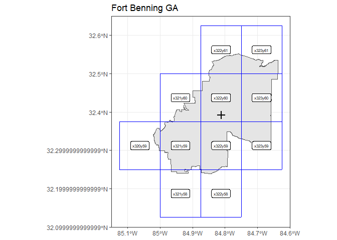<!-- -->

    ## 
    ## [[2]]

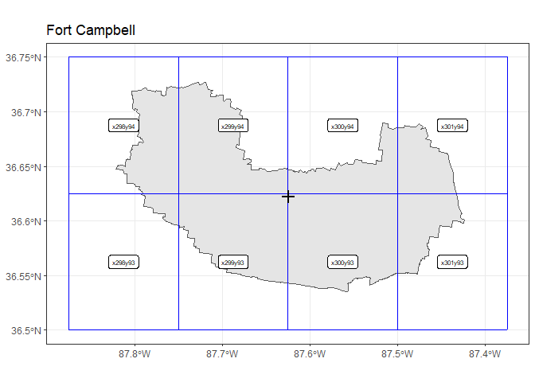<!-- -->

    ## 
    ## [[3]]

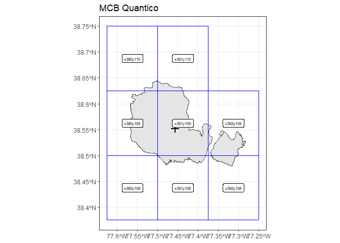<!-- -->

    ## 
    ## [[4]]

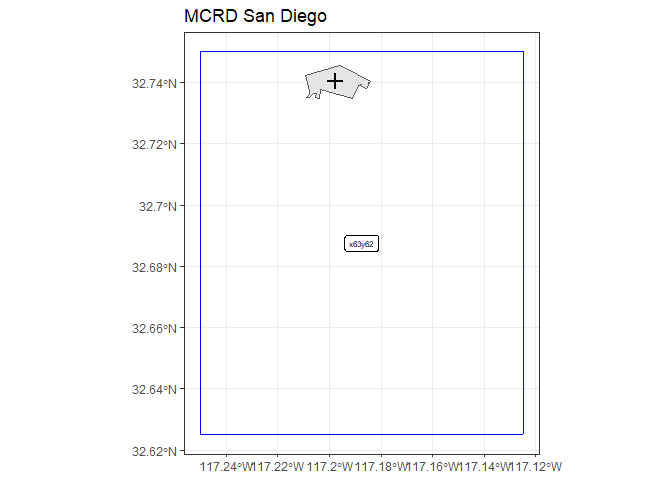<!-- -->

    ## 
    ## [[5]]

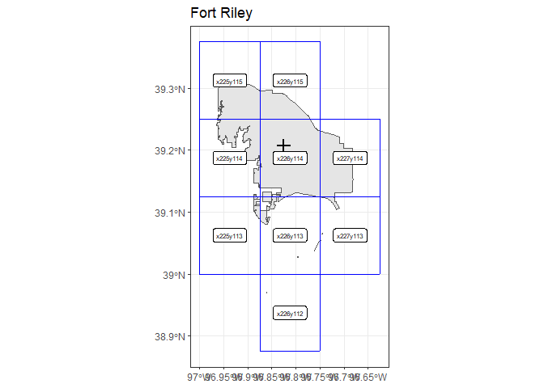<!-- -->

    ## 
    ## [[6]]

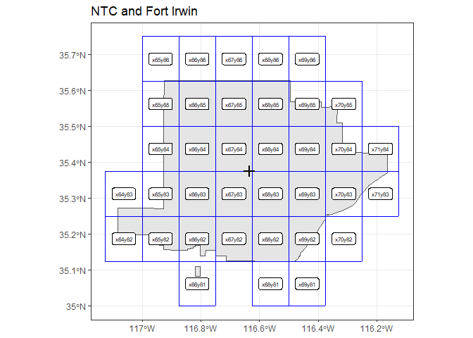<!-- -->

    ## 
    ## [[7]]

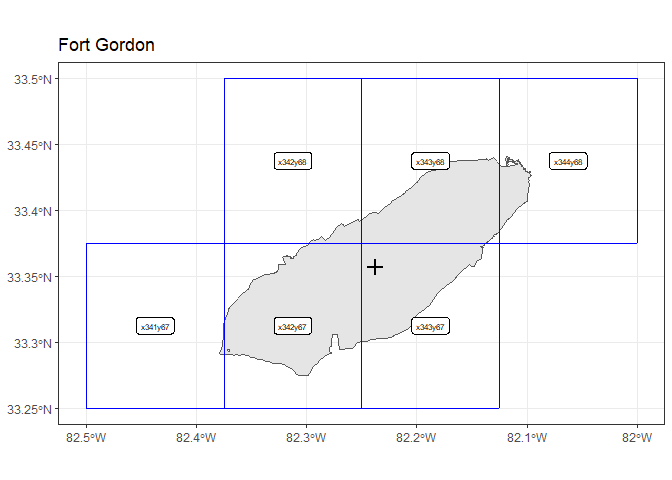<!-- -->

    ## 
    ## [[8]]

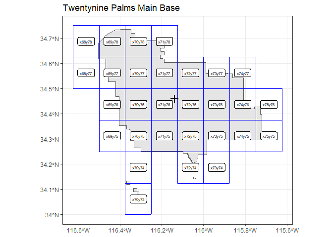<!-- -->

    ## 
    ## [[9]]

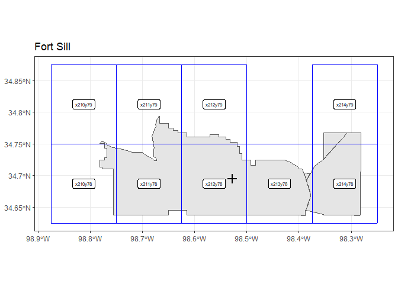<!-- -->

    ## 
    ## [[10]]

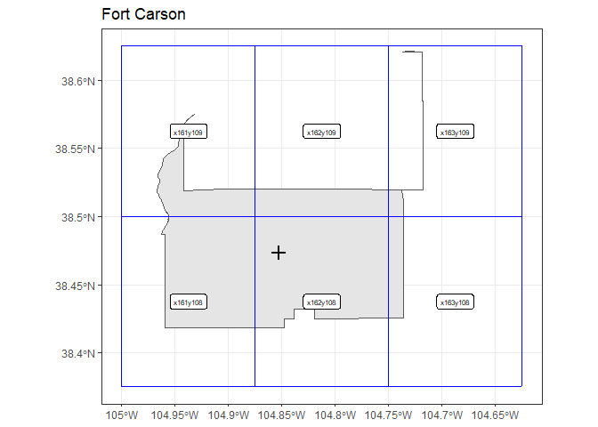<!-- -->

    ## 
    ## [[11]]

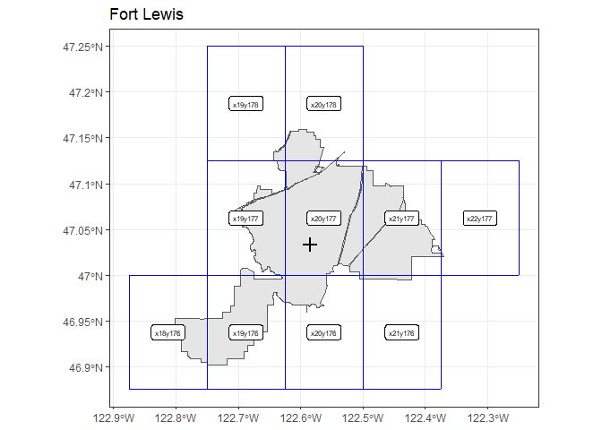<!-- -->

    ## 
    ## [[12]]

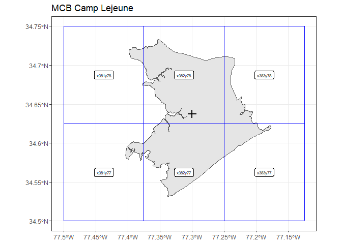<!-- -->

    ## 
    ## [[13]]

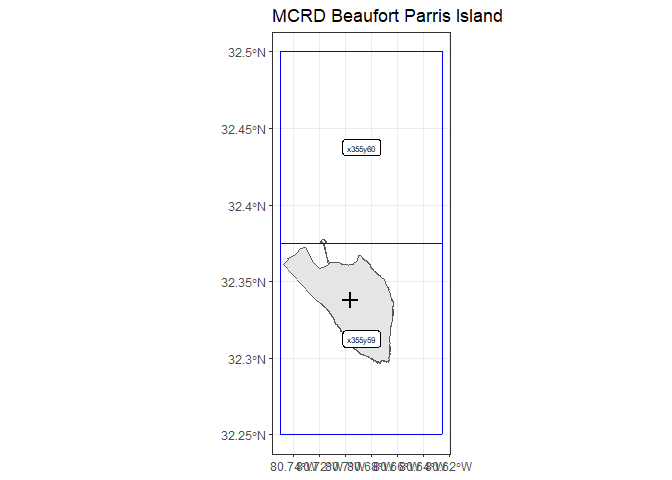<!-- -->

    ## 
    ## [[14]]

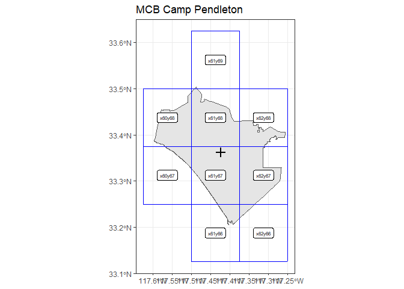<!-- -->

    ## 
    ## [[15]]

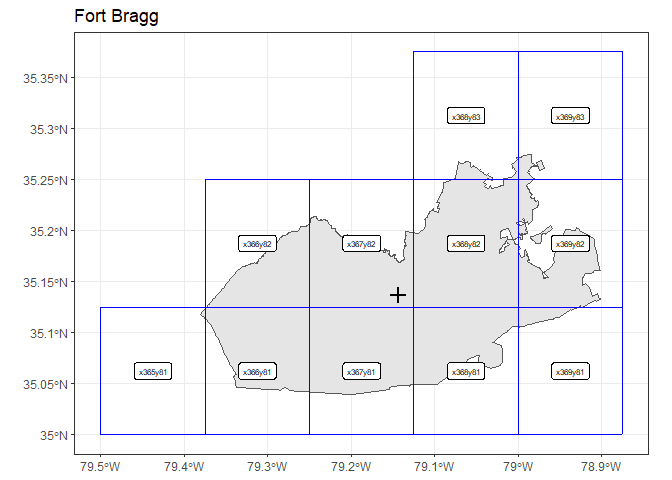<!-- -->

    ## 
    ## [[16]]

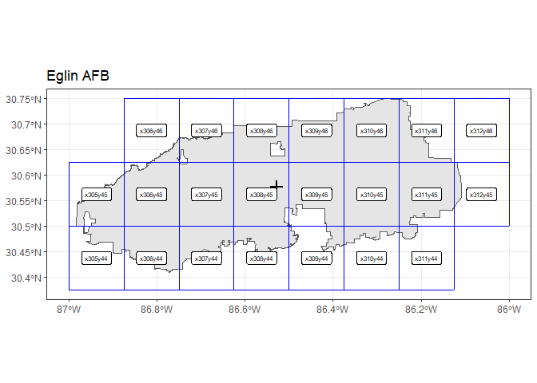<!-- -->

    ## 
    ## [[17]]

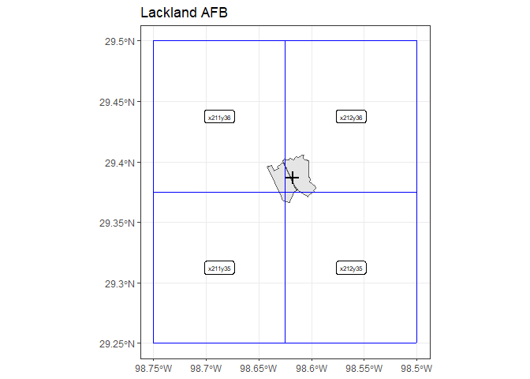<!-- -->

    ## 
    ## [[18]]

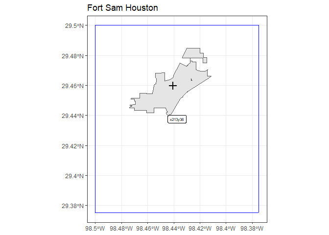<!-- -->

    ## 
    ## [[19]]

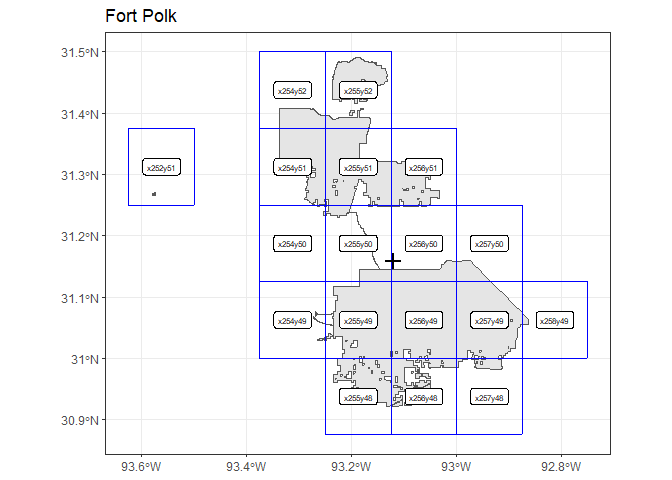<!-- -->

    ## 
    ## [[20]]

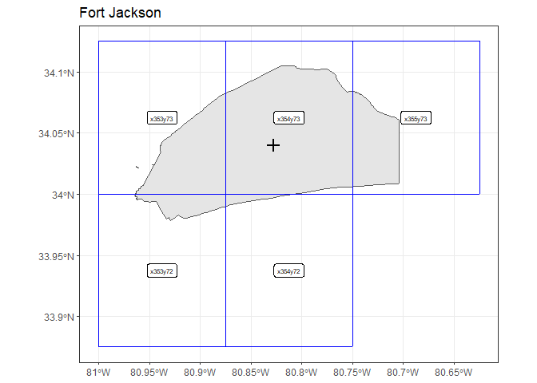<!-- -->

    ## 
    ## [[21]]

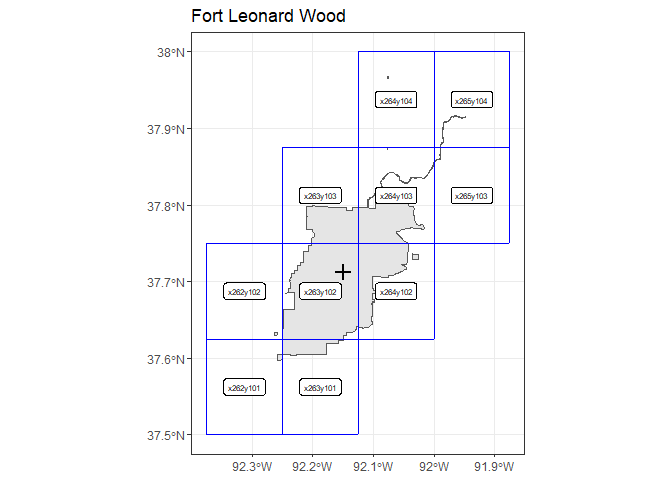<!-- -->

    ## 
    ## [[22]]

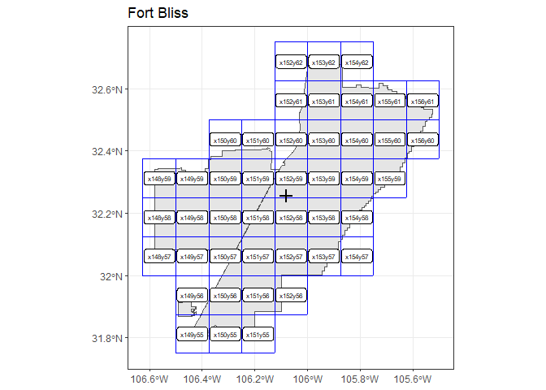<!-- -->

    ## 
    ## [[23]]

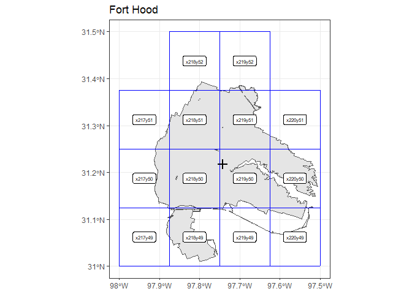<!-- -->

    ## 
    ## [[24]]

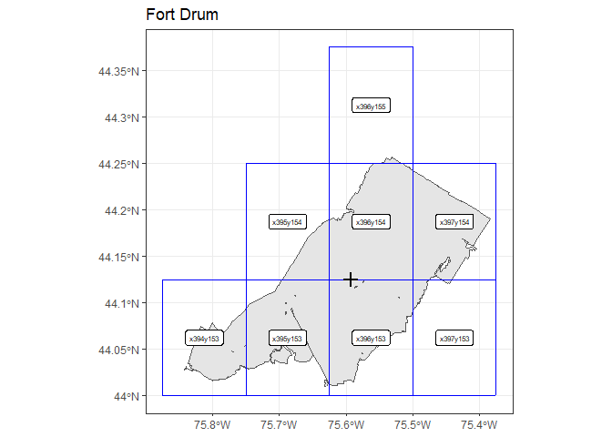<!-- -->

    ## 
    ## [[25]]

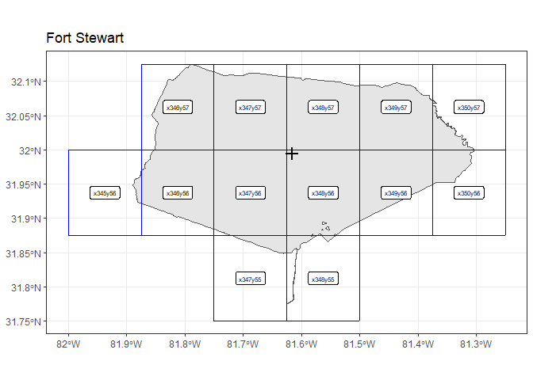<!-- -->
